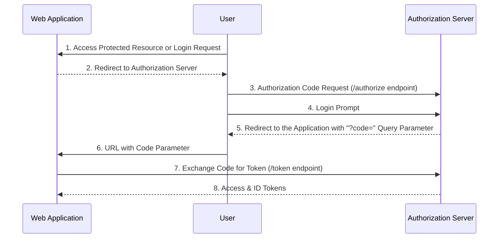
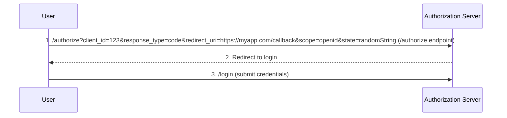
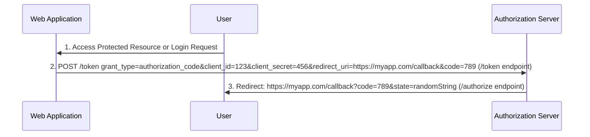
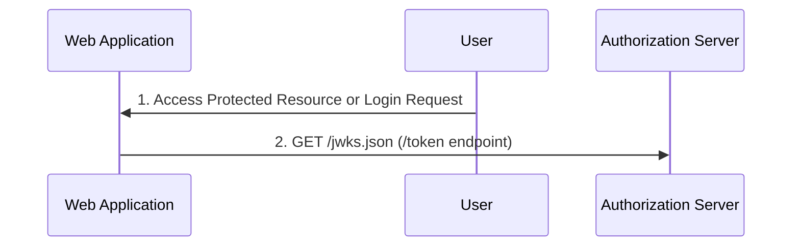

# Identity Provider (IdP)

## What is Identity Provider (IdP)?

- Simply put, an Identity Provider (IdP) **manages and maintains identity data** for users
- It's often used in conjunction with **Sigle Sign On (SSO)**
  - It gives a user a **single login & password (and optional MFA capability)**
- **OpenID Connect (OIDC)** and **Security Assertion Markup Language (SAML)** are authentication mechanisms, they don't store login/password information themselves
- You'd still need to validate the login, password, and potentially MFA token with a separate mechanism
  - Users can be in a database, in LDAP, Microsoft Active Directory, or others

## Why Implement OpenID Connect (OIDC)?

- It's great **learning experience**
  - Exposure to a lot of technologies: REST API, OAuth, JWT, JWK
- You're **often exposed to an IdP**, and it's worth understanding the inner workings
- You can **build you own** IdP authorization server, client, or application
  - Understanding how the how flow works **will help you** when you need to build one of these components

# OpenID Connect (OIDC)

## What is OpenID Connect (OIDC)?

- **OIDC** stands for **OpenID Connect**
- It's simple **identity layer on top of the OAuth 2.0 protocol**
- OIDC can **verify the identity** of a user using an **Authorization Server (AS)**
- OIDC uses **REST endpoints**, so it's **easily implemented**

## OIDC Flow

- Authorization Code Flow
  - For web applications that can store a _client_secret_
  - This is the flow we're going to implement
- Implicit Flow
  - For frontends/mobile apps that can't store a _client_secret_
- Hybrid Flow
  - Combines above two flows
  - Immediate access to an ID token









---

# Challenge

- Write **OpenID Connect (OIDC) Implementation**
- Start project (see below)

## Project Setup

- Clone the project from [GitHub](https://github.com/wardviaene/golang-for-devops-course.git)

```bash
git clone #PROJECT_URL#
cd #PROJECT_NAME/oidc-start#
```
