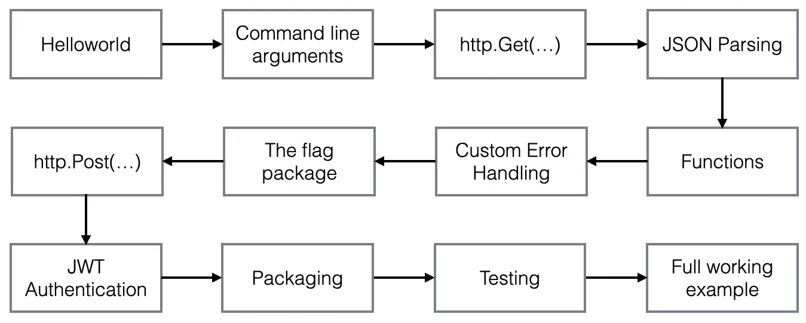
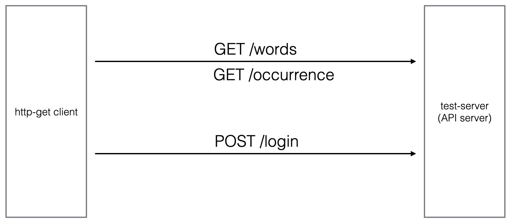

# Golang for DevOps And Cloud Engineers

## What is GO

- From the official Go homepage (https://golang.org/)
- Build **fast**, **reliable**, and **efficient** software at scale
    - Go is an **open source programming language** supported by Google
    - **Easy to learn** and get started with
    - **Built-in concurrency** and a **robust standard library**
    - Growing ecosystem of partners, communitiesm and tools

## Objectives

- To be able to read, understand and write Go code
- To be able to write enterprise ready applications
- To be able to write applications that integrate REST APIs
- To be able to write applications that integrate with cloud providers
- To be able to write applications that integrate with Kubernetes
- To be able to write applications that integrate with any custom integration that has a Go SDK available

## Our First Golang Application

### Go First Application

## Resources

- [PDF Slides](.github/pdf/Golang-for-DevOps-and-Cloud-Engineers.pdf)
- [Cheat Sheet](.github/pdf/Go-cheatsheet-2022-11-16.pdf)
- [GitHub Repo](https://github.com/wardviaene/golang-for-devops-course)
